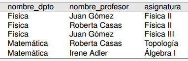
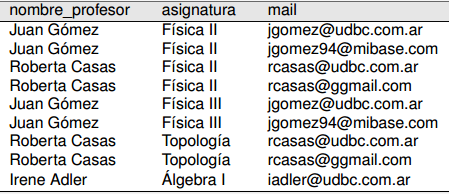
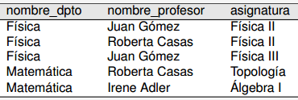
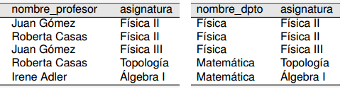
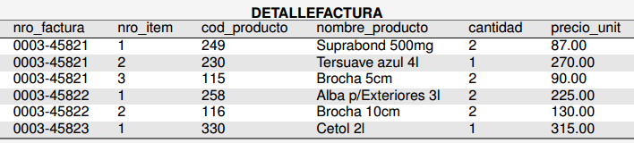
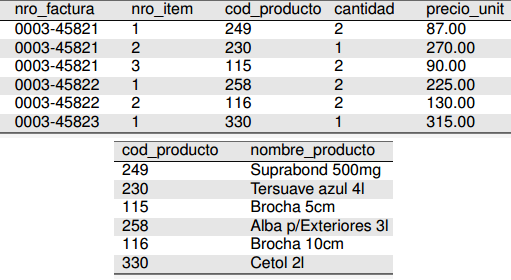
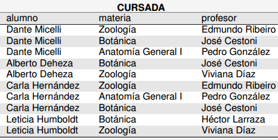
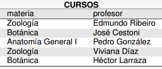

# Formas Normales

## 1ra Forma Normal:

Se dice que un esquema relacional está en la primera forma normal cuando los campos de todas sus relaciones son atómicos y monovaluados.

Ej de un esquema que NO está en la primera forma normal:

Una posible solución:

Se muda el atributo multivaluado a una nueva relación junto con la clave de la relación original.

## Dependencia funcional

Hay **DF** cuando en una relación, dados dos conjuntos de atributos X e Y, 2 tuplas con igual valor en los atributos del conjunto X necesariamente tienen también igual valor en los atributos del conjunto Y

### Dependencia funcional parcial

Hay **DFP** cuando un atributo depende de un subconjunto del conjunto de la clave primaria, y no de la clave primaria totalmente.

Ej:

En este caso el atributo _nombre_depto_ depende parcialmente de la clave primaria _(nombre_profesor, asignatura)_, porque sólo depende da la _asignatura_.

### Atributos primos:

Un **atributo primo** es un atributo que **forma parte de una clave candidata**.

Por definición, _asignatura_ es un **atributo primo** de la relación, por formar parte de la clave primaria.

## 2da Forma Normal:

Una relación esta en 2da forma normal cuando sus atributos **no primos** tienen **sólo dependencias funcionales completas con la clave primaria**. 

En resumen, ningún atributo excluido de las claves candidatas puede depender parcialmente de la clave primaria.

El ejemplo de la **DFP** anterior se respuelve separando la relacion en las dos siguientes:

### Descomposiciones

La solución anterior a la _Dependencia funcional parcial_ consiste en una **descomposición** de la relación original en dos relaciones.

Una descomposición se llama **equivalente** cuando:

- **Preservación de las dependencias:** Todas las dependencias funcionales de la relación original se pueden inferir a partir de las relaciones de la descomposición.
- **Preservación de la información:** No hay pérdida de información respecto de la relación original.

## Dependencia funcional transitiva

Es cuando un atributo **no primo** (o sea que no forma parte de la PK, ni de alguna clave candidata), depende funcionalmente de otro atributo **no primo**. Esto se denomina como una **dependencia funcional transitiva** entre atributos no primos.

Ej:

En este caso, la clave primaria sería _(nro_factura, nro_item)_.

El atributo _cod_producto_ depende funcionalmente de la clave primaria (completa), pero a su vez también _nombre_producto_ depende funcionalmente de _cod_producto_. Esto implica una **dependencia funcional transitiva.**

## 3ra Forma Normal

Un esquema que respeta la 3FN es un esquema **sin dependencias funcionales transitivas entre atributos no primos**. En el caso anterior se haría la siguiente descomposición:

Cabe mencionar que en esta descomposición _cod_producto_ termina siendo una FK de la nueva relación.

## Forma Normal de Boyce-Codd (FNBC)

La condición es similar a la de la 2FN, con la salvedad de que esta **no permite dependencias parciales de atributos primos tampoco**.

_Vale la pena aclarar que los atributos primos no necesariamente forman parte de la PK, pueden ser miembros de una clave candidata no primaria._

El siguiente ejemplo **no** respeta la forma normal de Boyce-Codd:

En este caso _(alumno, materia)_ y _(profesor, materia)_ son claves candidatas. No importa la clave primaria que se elija, **_alumno_ o _profesor_ dependería parcialmente de _materia_**.

Esto se resolvería con el siguiente esquema:

Como observación, en esta descomposición se pierde la dependencia funcional _(alumno, materia)_ --> _(profesor)_