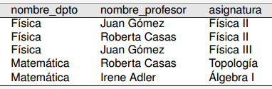
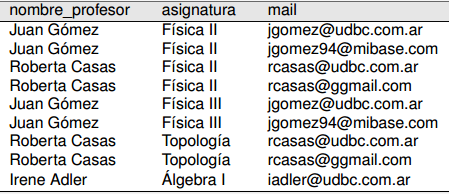

# Formas Normales

## 1ra Forma Normal:

Se dice que un esquema relacional está en la primera forma normal cuando los campos de todas sus relaciones son atómicos y monovaluados.

Ej de un esquema que NO está en la primera forma normal:

Una posible solución:

Se muda el atributo multivaluado a una nueva relación junto con la clave de la relación original.

### Dependencia funcional

Hay **DF** cuando en una relación, dados dos conjuntos de atributos X e Y, 2 tuplas con igual valor en los atributos del conjunto X necesariamente tienen también igual valor en los atributos del conjunto Y

### Dependencia funcional parcial

Hay **DFP** cuando un atributo depende de un subconjunto del conjunto de la clave primaria, y no de la clave primaria totalmente.

Ej:

En este caso el atributo _nombre_depto_ depende parcialmente de la clave primaria _(nombre_profesor, asignatura)_, porque sólo depende da la _asignatura_.

Por definición, _asignatura_ es un **atributo primo** de la relación, por formar parte de la clave primaria.

## 2da Forma Normal:

Una relación esta en 2da forma normal cuando sus atributos **no primos** tienen **sólo dependencias funcionales completas con la clave primaria**. 

En resumen, ningún atributo que no forme parte de la clave primaria puede depender parcialmente de la clave primaria.

El ejemplo de la **DPF** anterior se respuelve separando la relacion en las dos siguientes:

docente_asignatura: _(nombre_profesor, asignatura)_

asignatura_depto: _(asignatura, nombre_depto)_

### Descomposiciones

La solución anterior a la _Dependencia funcional parcial_ consiste en una **descomposición** de la relación original en dos relaciones.

Una descomposición se llama **equivalente** cuando:

- **Preservación de las dependencias:** Todas las dependencias funcionales de la relación original se pueden inferir a partir de las relaciones de la descomposición.
- **Preservación de la información:** No hay pérdida de información respecto de la relación original.

## 3ra Forma Normal: